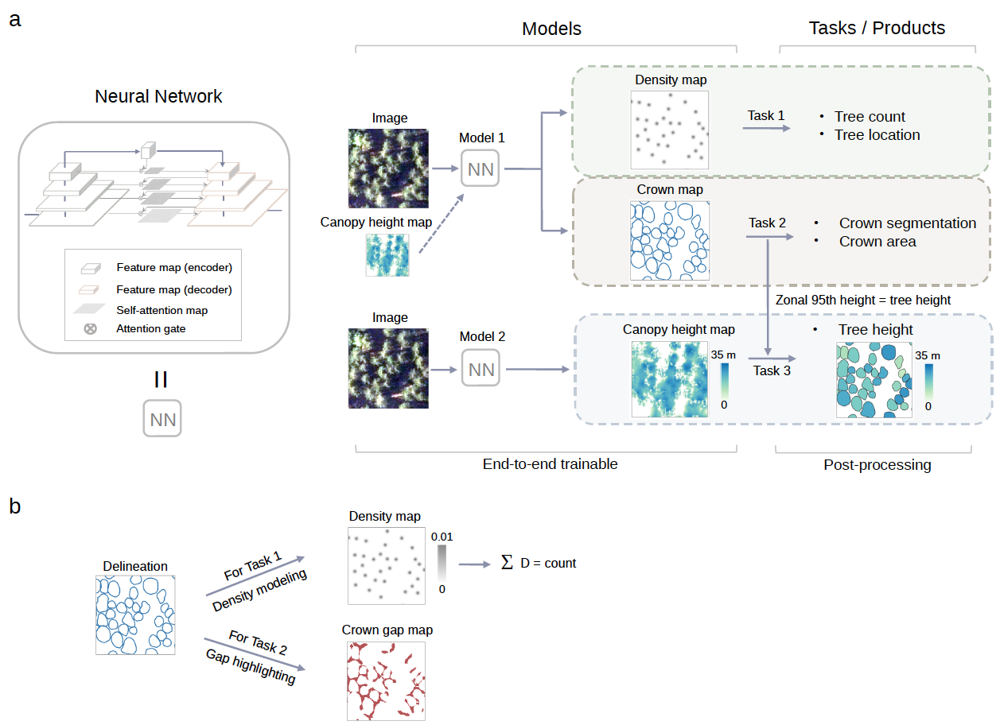

# TreeCountSegHeight

This repo contains code for the paper "Deep learning enables image-based tree counting, crown segmentation and height prediction at national scale", which has been accepted for publication in PNAS Nexus.

See the preprint at: https://doi.org/10.21203/rs.3.rs-1661442/v1.

Figure 1. Overview of the framework used to count individual trees and predict their crown area and height. a, Deep learning-based framework for individual tree counting, crown segmentation, and height prediction. Spatial locations of individual trees are incorporated in the tree density maps and the crown segmentation maps. The canopy height map (CHM) derived from LiDAR data provides pixel-wise height information, which, when available for a specific study area, can optionally be used as an additional input band for the individual tree counting and crown segmentation tasks. b, Data preparation and modeling for tree counting and crown segmentation. The manually delineated individual tree crowns are modeled as density maps for the counting task by extracting the polygon centroids. The gaps between adjacent crowns are highlighted for the separation of individual tree crowns during the training phase.
